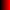
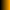
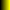
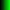
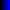
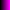
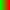
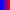
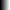

# QuickHeat

## Visualize your data with quick, beautiful heatmaps

### Beautiful

#### Solid

#### Mixed

#### Greyscale

### Simple

QuickHeat makes it easy to render heatmaps, simply pass in your vector matrix, desired color scheme, file name, and let QuickHeat do the rest

### Discreet

QuickHeat creates a discreet color scale to fit the range of your data. You can rest assured that any numerical data set you pass in will be properly represented on the heatmap.

### License

See [LICENSE](LICENSE.md)

