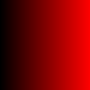
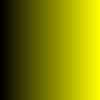
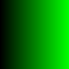
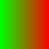
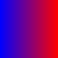
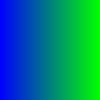
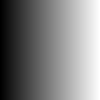

# QuickHeat

## Visualize your data with quick, beautiful heatmaps

### Beautiful

#### Solid







#### Mixed





#### Greyscale



### Simple

QuickHeat makes it easy to render heatmaps, simply pass in your vector matrix, desired color scheme, file name, and let QuickHeat do the rest

### Discreet

QuickHeat creates a discreet color scale to fit the range of your data. You can rest assured that any numerical data set you pass in will be properly represented on the heatmap.

### Usage

C++ implementation file

```cpp
#include "quickheat.hpp"

...

//  Select a colorscheme from the following preset options
//  colorScheme{GREYSCALE, BLUE, YELLOW, RED, GREEN, HEAT, PURPLE, ORANGE, PLASMA, GRAPE, RAINBOW}
colorScheme desiredColorScheme = BLUE;

// Load data into a two-dimensional vector matrix
std::vector<std::vector<float> > matrix;

//Render the heatmap by using the following function
render_heatmap(matrix, desiredColorScheme, "filename.svg");

```

### License

See [LICENSE](docs/LICENSE.md)
